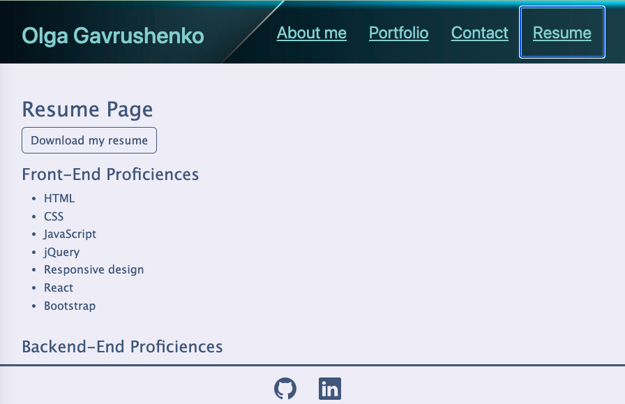

  # Olga Gavrushenko protfolio (React)

  

  ## Description
  
  This is portfolio of Olga Gavrushenko, which present contact points, projects, skills and link to resume.
  
  Tech Stack: 
  - React 
  - Bootstrap

  

  ## Table of Contents
 
  - [Installation](#installation)
  - [Usage](#usage)
  - [Credits](#credits)
  - [License](#license)
  - [Questions](#questions)
  - [Contribution](#contribution)
  - [Tests](#tests)
    
  ## Installation
  
  Deploy in github using gh-pages: ```npm run deploy```
  
  ## Usage
  
  Onen the link https://olgagav.github.io/portfolio-olga-gavrushenko-react/ 
  
  __Portfolio__ page has links to recent projects, github and deployed applications, and stack used in this project

  At __Resume__ page provided skill and link to download resume which inlude past projects and previous woking experience. 

  In case of any opportunities feel free to send message from __Contact__ page
  
  ## Credits
  
  <br> - Olga Gavrushenko; <br> - [How to create a Professional README](https://coding-boot-camp.github.io/full-stack/github/professional-readme-guide); <br> - UC Berkley Extension Learning materials
  
  ## License
  
  

  This application is available under the license: None. 
    See the LICENSE file for more info. Full details available by link . 
    
 
  ## Questions
  
  Link to my GitHub profile https://github.com/olgagav/
  
  If you have additional questions or proposals please email me: [ogavby@gmail.com](mailto:ogavby@gmail.com?subject=[GitHub]%20command-line%20password%20generator)
    
  ## Contribution

  Contributions are what make the open source community such an amazing place to learn, inspire, and create. Any contributions you make are greatly appreciated.
   <br>Fork the Project <br> - Create your Feature Branch <br> - Commit your Changes <br> - Push to the Branch <br> - Open a Pull Request
  
  ## Tests
  
  n/a
  